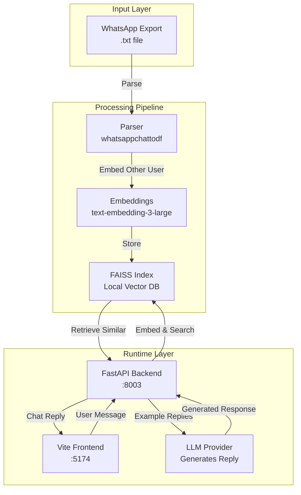
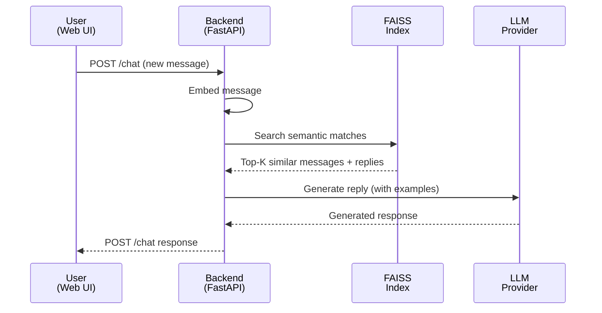

# WhatsApp GenAI Chat

Chat with an AI that responds like one participant from a WhatsApp export.

The app parses a two-person WhatsApp `.txt` export, builds a local FAISS index over one participant's messages, retrieves similar historical turns for a new message, and asks an LLM to synthesize a reply in the selected participant's style. It includes a FastAPI backend and a small WhatsApp-like Vite frontend.

## Quick Start

```bash
# Install dependencies
uv sync --extra dev
cd frontend && npm install && cd ..

# Prepare configuration
cp .env.example .env
# Edit .env with your provider (azure_openai, openai, google, or anthropic)

# Build index from a WhatsApp export
make index FILE=data/chat-sample.txt

# Run the app
make dev
```

Open [http://localhost:5174](http://localhost:5174) in your browser.

## Features

- **Multi-provider LLM support**: Azure OpenAI, OpenAI, Google Gemini, or Anthropic
- **Local vector search**: FAISS-based semantic indexing of historical messages
- **Persona imitation**: Bot learns and mimics one participant's communication style
- **Efficient retrieval**: Fetches similar messages and follow-up replies as style examples
- **Full-stack application**: FastAPI backend + Vite frontend included
- **One-command workflows**: Makefile simplifies building indexes and running the app

## System Architecture



## Workflow Diagram



## How It Works

1. **Indexing Phase**: A WhatsApp export is parsed into a dataframe with `sender` and `message` columns. You choose which participant the bot will simulate. The *other* participant's messages are embedded and stored in a FAISS index.

2. **Chat Phase**: When you send a message, the backend embeds it and searches the FAISS index for semantically similar historical messages. For each match, it retrieves that participant's immediate follow-up replies as style examples.

3. **Response Generation**: The configured LLM receives those replies as context and generates a new response in the simulated participant's style.

**Terminology**: In the codebase, `user1` is the participant being simulated by the bot, and `user2` is the human user interacting with the chat interface.

## Requirements

- **Python**: `>=3.12` (recommended for best FAISS wheel availability)
- **Node.js & npm**: For the Vite frontend
- **uv**: Python environment and package manager
- **WhatsApp export**: A two-person chat as `.txt` file
- **LLM access**: At least one supported provider (see [Provider Configuration](#provider-configuration))

## Project Structure

```text
.
├── frontend/                       # Vite React UI
│   ├── index.html
│   ├── main.js
│   ├── style.css
│   └── vite.config.js
├── whatsapp_genai_chat/
│   ├── api/
│   │   ├── main.py                 # FastAPI application
│   │   └── routes.py               # API endpoints
│   ├── core/
│   │   ├── parser.py               # WhatsApp export parser
│   │   ├── indexer.py              # FAISS index builder
│   │   └── retriever.py            # Semantic search & retrieval
│   └── llm/
│       ├── base.py                 # Provider interface
│       ├── factory.py              # Provider factory
│       └── *_provider.py           # Provider implementations
├── scripts/
│   └── build_index.py              # Interactive index building script
├── tests/                          # Unit & API tests
├── data/                           # WhatsApp exports (gitignored)
├── indexes/                        # FAISS pickle files (gitignored)
├── Makefile                        # Build & run commands
├── pyproject.toml                  # Python dependencies
├── requirements.txt
└── README.md
```

**Important**: `data/`, `indexes/`, `.env`, and other local artifacts are in `.gitignore` to keep private chats and credentials secure.

## Setup & Installation

### 1. Install Python Dependencies

```bash
uv sync --extra dev
```

### 2. Install Frontend Dependencies

```bash
cd frontend
npm install
cd ..
```

### 3. Create Environment Configuration

```bash
cp .env.example .env
```

Edit `.env` to select your provider and add credentials. See [Provider Configuration](#provider-configuration) for detailed setup for each provider.

## Provider Configuration

Select your LLM and embedding provider by setting the `PROVIDER` variable:

```env
PROVIDER=azure_openai  # or: openai, google, anthropic
```

### Supported Providers

| Provider | LLM | Embeddings | Auth | Notes |
|----------|-----|-----------|------|-------|
| `azure_openai` | ✅ | ✅ | `DefaultAzureCredential` | No API key needed; use `az login` |
| `openai` | ✅ | ✅ | `OPENAI_API_KEY` | Full-featured, widely used |
| `google` | ✅ | ✅ | `GOOGLE_API_KEY` | Gemini models available |
| `anthropic` | ✅ | ❌ | `ANTHROPIC_API_KEY` | Cannot build indexes alone; use for LLM-only |

**Note**: Because the factory uses the same `PROVIDER` for both LLMs and embeddings, `PROVIDER=anthropic` cannot build an index or run the full app independently. Use `azure_openai`, `openai`, or `google` for indexing.

### Azure OpenAI

```env
PROVIDER=azure_openai
AZURE_OPENAI_ENDPOINT=https://your-resource.openai.azure.com/
AZURE_OPENAI_VERSION=2024-02-01
AZURE_LLM_DEPLOYMENT_NAME=gpt-4.1
AZURE_EMBEDDING_DEPLOYMENT_NAME=text-embedding-3-large
```

**Authentication**: Uses `DefaultAzureCredential`. Log in locally:

```bash
az login
```

### OpenAI

```env
PROVIDER=openai
OPENAI_API_KEY=sk-...
OPENAI_MODEL=gpt-4o
OPENAI_EMBEDDING_MODEL=text-embedding-3-large
```

Get your API key from [platform.openai.com](https://platform.openai.com).

### Google

```env
PROVIDER=google
GOOGLE_API_KEY=...
GOOGLE_MODEL=gemini-2.0-flash
GOOGLE_EMBEDDING_MODEL=models/text-embedding-004
```

Get your API key from [Google AI Studio](https://aistudio.google.com/apikey).

### Anthropic

```env
PROVIDER=anthropic
ANTHROPIC_API_KEY=...
ANTHROPIC_MODEL=claude-sonnet-4-6
ANTHROPIC_MAX_TOKENS=2048
```

Get your API key from [console.anthropic.com](https://console.anthropic.com). Note: Anthropic generates replies but cannot provide embeddings for indexing.

## Usage Guide

### Step 1: Prepare a WhatsApp Export

1. Export a **two-person chat** from WhatsApp as a `.txt` file
2. Save it in the `data/` directory

Example: `data/chat-sample.txt`

The parser uses `whatsappchattodf` and expects these columns:
- `User` → normalized to `sender`
- `Message` → normalized to `message`

### Step 2: Build an Index

Run the interactive index builder:

```bash
make index FILE=data/chat-sample.txt
```

**What happens:**
1. Parses the chat export
2. Verifies exactly two senders exist
3. Asks which participant to simulate
4. Embeds the other participant's messages in batches
5. Saves the FAISS index to `indexes/<chat-file-stem>.pkl`

**Managing multiple indexes**: If you have multiple `.pkl` files in `indexes/`, set `INDEX_PATH` in `.env`:

```env
INDEX_PATH=/absolute/path/to/indexes/chat-sample.pkl
```

### Step 3: Run the Application

Start both backend and frontend:

```bash
make dev
```

Or run them separately:

```bash
make backend  # FastAPI on :8003
make frontend # Vite on :5174
```

**To use a specific index for this session:**

```bash
make dev FILE=indexes/chat-sample.pkl
```

**Access the UI**: Open [http://localhost:5174](http://localhost:5174)

## API Reference

The backend runs on port `8003` and exposes two endpoints:

### GET `/health`

Returns the loaded index status and participant names.

**Response:**
```json
{
  "status": "ok",
  "user1": "Alice",
  "user2": "Bob"
}
```

### POST `/chat`

Generates a reply based on the user's message and historical style examples.

**Request:**
```json
{
  "message": "hello there"
}
```

**Response:**
```json
{
  "reply": "Hey! I'm good.",
  "user1": "Alice"
}
```

**Constraints:**
- `message` field is required
- Limited to 2,000 characters

## Development

### Make Targets

Run `make help` to see all available targets:

| Target | Description |
|--------|-------------|
| `make dev` | Run backend and frontend together |
| `make dev FILE=indexes/chat.pkl` | Run app with a specific index |
| `make backend` | Run FastAPI backend on port 8003 |
| `make frontend` | Run Vite frontend on port 5174 |
| `make index FILE=data/chat.txt` | Build a FAISS index from WhatsApp export |
| `make help` | Show all available targets |

### Running Tests

Execute the test suite:

```bash
uv run pytest
```

**Test coverage:**
- WhatsApp export parsing
- FAISS index construction and persistence
- Message retrieval and ranking
- FastAPI route behavior
- LLM provider factory
- Edge cases and error handling

## Troubleshooting

### Index Issues

#### No index found in indexes/

**Error:**
```
No index found in indexes/
```

**Solution**: Build an index first:
```bash
make index FILE=data/chat-sample.txt
```

#### Multiple indexes found

**Solution**: Specify which index to use via `.env`:
```env
INDEX_PATH=/absolute/path/to/the-index.pkl
```

Or pass it directly when running:
```bash
make dev FILE=indexes/chat-sample.pkl
```

### Connection Issues

#### Backend offline in the frontend

**Cause**: Frontend can't reach the backend at `http://localhost:8003`

**Solution**: Ensure the backend is running:
```bash
make backend
```

#### CORS errors

**Error**: Cross-origin requests blocked in browser

**Solution**: Verify CORS origins in `.env`:
```env
CORS_ORIGINS=http://localhost:5174,http://127.0.0.1:5174
```

Override if needed for different hosts or ports.

### Provider & Authentication Issues

#### Azure authentication errors

**Cause**: Not authenticated or no access to the Azure OpenAI resource

**Solutions**:
```bash
# Authenticate with Azure
az login

# Verify deployment names match your resource
# (Check .env against Azure portal)
```

#### Missing FAISS or parser dependencies

**Solution**: Reinstall the environment:
```bash
uv sync --extra dev
```

If FAISS wheels are unavailable for your Python version, try Python 3.12:
```bash
python3.12 -m venv venv
source venv/bin/activate
uv sync --extra dev
```

## Privacy & Security

### Data Handling

- **WhatsApp exports** are private personal data. Keep them in `data/` which is gitignored.
- **Generated indexes** are stored in `indexes/` which is gitignored.
- **Credentials** are in `.env` which is gitignored.
- **Do not commit**: `.txt` files, `.pkl` indexes, `.env`, or other local artifacts.

### LLM Provider Privacy

The app sends to your configured LLM provider:
- Retrieved message examples from the chat history
- Your current chat prompt
- Generated responses

**Before using real personal chats**, review your provider's privacy policy:
- [OpenAI Privacy Policy](https://openai.com/privacy)
- [Google AI Privacy Policy](https://policies.google.com/privacy)
- [Anthropic Privacy Policy](https://www.anthropic.com/privacy)
- [Microsoft Privacy (Azure)](https://privacy.microsoft.com/)

Consider using sample or anonymized chat data for testing first.

## License

MIT. See [LICENSE](LICENSE) for details.
